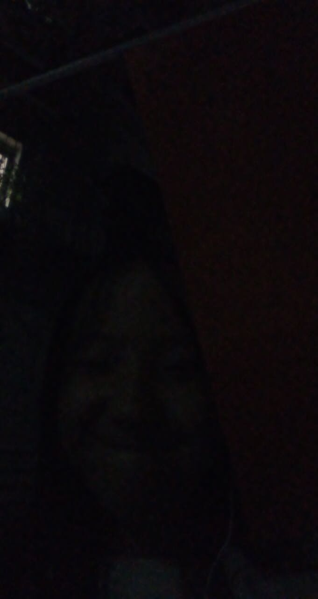

##以后出门自己照顾自己
##哪怕是一个人也是
##你总会遇到对的他
##不妨和生活硬碰硬

# 孤独的日子总会过去
   

# Header 1 我们只需负重前行
我有一段时间和你一样。我就羡慕窗
外对面一户人家。他们一家人在一起
，其乐融融，笑着，说着。那一夜就
只有我一个人，泪渐渐打湿了我的眼
眶，喃喃自语。
  

# Header 2 不要羡慕，毕竟父母出去打拼也不容易打拼也不容易
# Header 3 我们现在只需好好努力学习就好了，不是么
# Header 4 我那时候家里没人管，玩疯了。看到爸妈在自己面前哭泣真的感觉很对不起

